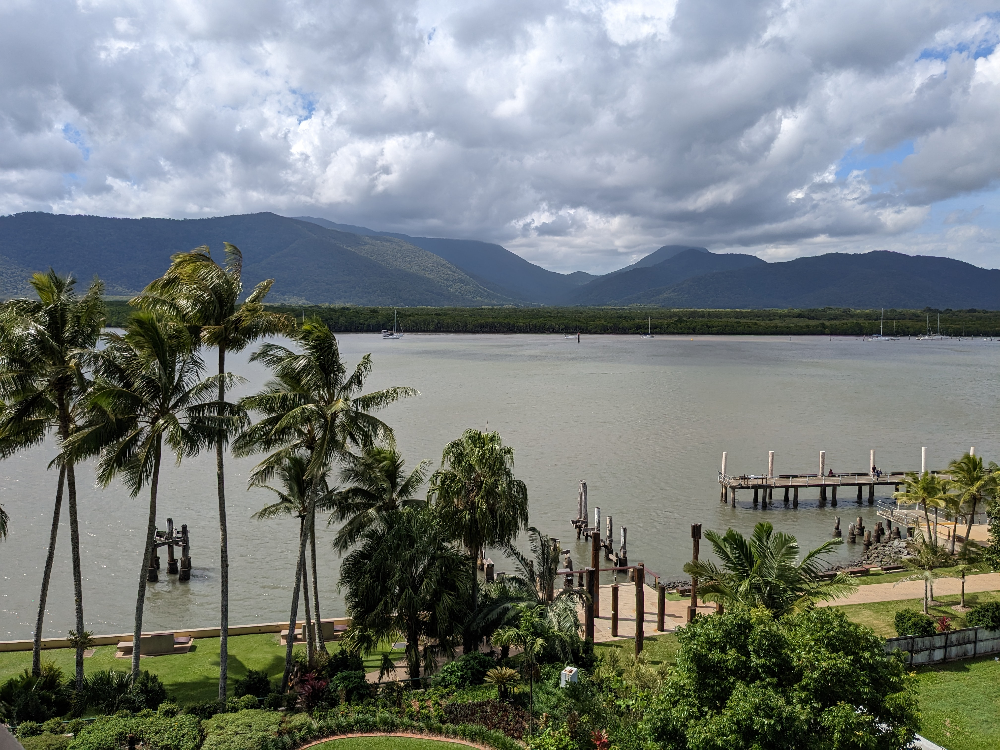

# International Experience

Working and travelling across different countries has played a key role in shaping my professional development.

These experiences strengthened my ability to adapt, communicate, and operate in complex international environments.

More importantly, they influenced how I approach data and problem solving, by connecting analytical thinking with real-world operational and business contexts.

---

## 🇯🇵 Japan (Living & Working)

:::: {.columns}
::: {.column width="50%"}

:::

::: {.column width="50%"}

:::
::::

Living in Japan for over a decade shaped my approach to structured problem solving and process-driven environments.

This experience helped me develop:

- strong attention to detail  
- discipline in execution  
- the ability to work effectively in highly structured systems  

**Key takeaway:**  
Strong systems, consistency, and disciplined execution are essential for scalable and reliable outcomes.

## 🇲🇾 Malaysia (Sony – Factory & Product Development)

:::: {.columns}
::: {.column width="50%"}

:::

::: {.column width="50%"}

:::
::::

During my time at Sony, I regularly visited manufacturing sites in Malaysia to support the transition from prototype development to mass production.

This experience exposed me to:

- end-to-end product lifecycle processes  
- coordination between engineering, manufacturing, and operations  
- the practical challenges of scaling from development to production  

**Key takeaway:**  
Data and decisions must align with operational reality, not just technical theory.

## 🇦🇺 Australia (Client Delivery – UAT & Go-Live)

:::: {.columns}
::: {.column width="50%"}

:::

::: {.column width="50%"}

:::
::::

While working in consulting, I spent several months onsite in Australia supporting clients during UAT and system go-live phases.

This involved:

- working directly with stakeholders in critical delivery stages  
- coordinating across teams during high-pressure implementation periods  
- supporting issue resolution and system readiness  

**Key takeaway:**  
Clear communication, adaptability, and stakeholder coordination are essential in business-critical delivery environments.

## Overall Reflection

These international experiences shaped how I approach analytics and problem solving.

They strengthened my ability to:

- understand the context behind data  
- adapt to different environments and working styles  
- communicate effectively across teams and stakeholders  
- connect technical work with real operational and business needs  

These experiences continue to influence how I think about analytics, delivery, and decision-making in global organisations.

